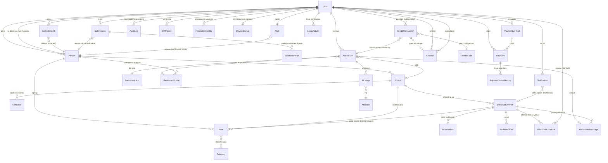

# Lehno — Documentation fonctionnelle

*lehno.app — assistant personnel des dates qui comptent*

## Sommaire

1. Présentation générale
2. Acteurs et rôles
3. Glossaire
4. Modèle de données conceptuel
5. Gestion des personnes
6. Événements et jalons
7. Prise de notes et classement
8. Les catégories de la fiche personne
9. Rappels et notifications
10. Génération assistée (portrait, idées, message)
11. Relances anti-oubli
12. Collecte externe (entrante)
13. Mur personnel et acquisition (sortante)
14. Règles de gestion transverses
15. Comptes, multi-tenant et offre commerciale
16. Crédits et actions premium
17. Confidentialité et protection des données
18. Contraintes techniques
19. Phasage de l'implémentation

---

## 1. Présentation générale

### Contexte

**Lehno** (lehno.app) est un **assistant personnel des dates qui comptent**. Il est né d'un besoin propre : ne plus laisser passer les anniversaires et jalons des proches, ne plus oublier de leur envoyer un mot le jour venu, et disposer au bon moment d'une matière déjà prête pour célébrer chaque personne de façon juste.

Le nom recouvre l'ensemble des dates traitées par l'application — anniversaire, mais aussi rencontre, mariage, lancement, tout jalon important. Lehno retient au fil de l'année ce qui concerne chaque proche et prépare, le moment venu, de quoi agir : idées de célébration, brouillon de message.

L'outil ajoute une couche autour de la date : une mémoire vivante sur chaque proche, alimentée au fil de l'année par des notes libres, et une assistance qui transforme cette mémoire en propositions concrètes au moment où elles servent.

### Pour qui

**Le principe qui traverse tous les usages.** On pense à quelqu'un à un moment, et on en a besoin à un autre. Une idée de cadeau surgit en mars pour un anniversaire de septembre ; une confidence entendue au dîner servira dans six mois. Lehno tient ce décalage : **on capture quand on y pense, on retrouve quand ça compte**. Et lorsque rien n'a été noté, les relances vont chercher la matière.

Trois profils, trois façons d'y trouver son compte.

**Awa, 32 ans — le cœur de cible.** Chargée de projet, son téléphone est son bureau. Une famille large, des amis fidèles, des partenaires qu'elle aime saluer aux bons moments : **une quarantaine de personnes** dont elle voudrait suivre les dates. Ce qui la décide, c'est un anniversaire souhaité avec deux jours de retard à quelqu'un qui compte. Avec Lehno, elle note au détour d'une conversation — dix secondes — et retrouve tout à l'approche de la date. Ce qu'elle y gagne : **l'esprit libre**.

**Karim, 35 ans — celui qui veut bien faire, sans y penser tout le temps.** Il sait qu'il ne faut pas rater ces dates ; simplement, sa charge mentale est ailleurs et elles lui reviennent trop tard. Il tient à ces gens autant qu'Awa aux siens : ce qui lui manque, c'est le réflexe. L'application tient la trace à sa place, le relance pour qu'il ajoute deux mots sur quelqu'un, et lui donne le jour venu de quoi agir tout de suite. C'est lui qui **porte le modèle économique** : il veut le résultat sans le travail, donc il achète des crédits — le message d'abord.

**Sarah, 27 ans — celle qui célèbre autant qu'elle est célébrée.** Très présente en ligne, elle suit les dates de ses proches mais aime aussi qu'on la fête : elle tient sa liste de souhaits, la partage, et relit les messages reçus l'an dernier. Elle fait vivre le Mur et les vœux, et c'est par elle que ses proches **découvrent l'application**.

**Ce que ces trois profils impliquent.** Awa demande une capture immédiate ; Karim, des relances efficaces et un chemin du rappel à l'action en un geste ; Sarah, des surfaces publiques soignées. Le même produit sert les trois, à condition que chacune de ces trois qualités soit tenue.

### Objectifs fonctionnels

L'application poursuit trois objectifs, de même niveau d'importance :

**Ne pas oublier la date.** Centraliser les anniversaires et les jalons importants des proches, et alerter à temps pour chacun.

**Ne pas oublier d'agir.** Rappeler l'envoi du message le jour de l'échéance, y compris lorsque la date est déjà connue de l'utilisateur — car le raté fréquent n'est pas seulement d'ignorer la date, mais de la connaître et de ne rien faire.

**Aider à bien célébrer.** Proposer, à l'approche de chaque échéance, la meilleure façon de marquer le coup pour la personne concernée : l'idée de cadeau adaptée, le mot qui touche, en s'appuyant sur ce qui a été noté à son sujet.

### Périmètre couvert

L'application couvre : la gestion des fiches personnes, la saisie et le classement de notes libres, la définition d'événements et de leurs jalons, les rappels par e-mail et notification push, la génération assistée de portraits, d'idées et de brouillons de message, les relances périodiques de saisie, la collecte d'informations auprès de tiers via des liens partageables, et la publication par l'utilisateur d'un mur personnel exposant ses propres goûts et sa liste de souhaits.

### Hors périmètre (à ce stade)

L'application n'assure pas l'envoi automatique des messages aux destinataires : l'utilisateur reste maître de l'envoi, qu'il effectue depuis son propre canal (messagerie, réseau social). Elle n'intègre pas de fonction d'achat de cadeau ni de passerelle marchande. Enfin, une fiche personne appartient à un seul compte : deux utilisateurs ne peuvent pas co-gérer ou co-éditer la même fiche (par exemple tenir à deux la fiche d'un parent commun).

---

## 2. Acteurs et rôles

**L'utilisateur (User).** Propriétaire d'un compte et de l'ensemble des données qui s'y rattachent. Il crée les fiches, saisit les notes, reçoit les rappels, valide les informations entrantes et déclenche la génération assistée. C'est l'acteur principal ; l'application est conçue avant tout pour lui.

**Le répondant / visiteur externe.** Personne extérieure qui interagit avec une page publique de l'application sans posséder de compte. Sur une surface de collecte, elle renseigne sa date d'anniversaire et, éventuellement, un souhait ou un mot ; ce qu'elle soumet n'entre jamais directement dans les données de l'utilisateur mais passe par une étape de validation. Sur un mur personnel, elle consulte les goûts et souhaits publiés par l'utilisateur. Dans les deux cas, elle peut se voir proposer de créer son propre espace.

**Le système.** Regroupe les traitements automatiques : classement des notes, détection des événements sensibles, calcul des échéances, envoi des rappels, génération de contenu par IA et déclenchement des relances.

**L'administrateur (Admin).** Rôle d'exploitation tenu par l'éditeur de l'application, distinct de l'utilisateur et de ses données. Il opère le back-office (une interface **web**) : suivi des comptes, gestion des crédits et des recharges, modération des murs publics, traitement des demandes de suppression, métriques. Cet accès accompagne le lancement public de l'application, dès lors que des utilisateurs externes — potentiellement payants — sont présents.

---

## 3. Glossaire

**User** — Titulaire d'un compte ; racine de toutes les données, qui lui sont cloisonnées. Compte et titulaire sont une seule et même entité. Identité interne par `id` UUID ; connexion par e-mail vérifié par OTP ; porte un `username` (pseudo) unique.

**OTPCode** — Code à usage unique (haché, expirant vite) pour vérifier l'e-mail et authentifier la connexion.

**FederatedIdentity** — Rattachement d'un compte à Google ou Apple, pour se connecter en un geste sans renoncer à la connexion par code.

**DeviceSignup** — Trace des créations de compte par appareil, qui sert à plafonner leur nombre et à limiter l'abus du parrainage.

**NotificationPreference** — Réglage d'une nature de message pour un utilisateur ; l'absence de ligne vaut valeurs par défaut.

**Device** — Appareil enregistré pour recevoir les notifications poussées, distinct de `DeviceSignup`.

**RefreshToken** — Jeton de rafraîchissement d'une session, dont la rotation permet de détecter le vol d'une copie.

**WaitlistSignup** — Adresse déposée sur la liste d'attente pendant le pré-lancement, rattachée à aucun compte.

**SupportRequest / Feedback / DataExportRequest** — Message à l'équipe, avis laissé depuis l'application, demande d'export de ses données.

**PaymentMethod** — Moyen de paiement enregistré par un `User` pour ses recharges, et destination d'un éventuel remboursement. Une carte reste chez le prestataire, qui en rend une référence ; un compte mobile money s'identifie par son numéro, conservé chiffré car il sert à lancer les transactions.

**GiftGiven** — Ce qui a été offert à un proche une année donnée, pour que la génération d'idées écarte ce qui a déjà servi.

**PaymentStatusHistory** — L'historique des états d'un paiement : une ligne par état, avec son début, sa fin, ce qui l'a provoqué et qui en est l'auteur.

**Payment** — Achat de crédits réglé par un `User`, ou remboursement versé ; alimente l'historique des paiements et les reçus.

**LoginActivity** — Trace de toutes les tentatives de connexion (succès et échecs, IP, appareil), consultable par l'`Admin` ; sécurité et diagnostic.

**Person** — Un proche pour lequel l'utilisateur tient une fiche. L'utilisateur possède aussi sa propre `Person` (self-Person), support de son `Wall`.

**Event** — Une occasion datée rattachée à une `Person`, qui déclenche des rappels. L'anniversaire en est une configuration particulière (récurrence annuelle, tonalité `happy`).

**Anniversaire (birthday)** — `Event` de `kind = birthday` : récurrence annuelle. Cas central autour duquel l'expérience est conçue.

**Milestone (jalon)** — Point de déclenchement ponctuel d'un `Event`, exprimé comme un `Schedule` de type offset (+1 mois, +3 mois, +6 mois…).

**Schedule** — Règle qui transforme la date de référence d'un `Event` en échéances : récurrente (unité + intervalle) ou offset ponctuel.

**EventOccurrence** — Instance datée d'un `Event` pour une année donnée (l'anniversaire 2026 vs 2027) ; ancrage de tout le contenu millésimé (wishlist, générations, vœux reçus, rappels).

**eventNature** — Tonalité d'un `Event` : `happy` ou `sensitive`. `sensitive` (détecté automatiquement) supprime les idées cadeaux et ajuste le registre du message. Indépendante de la structure temporelle.

**Note** — Unité d'information libre saisie au sujet d'une `Person`, classée automatiquement dans une ou plusieurs `Category`.

**Category** — Catégorie de classement d'une `Note` (idées cadeaux, faits marquants, intérêts / goûts, dislikes / no-go, etc.). Antérieurement appelée « tiroir » dans les échanges.

**OwnerWish** — **Mon** souhait, sur **ma** liste, rattaché à une occasion qui m'appartient. Sa raison d'être est d'être partagé : c'est la surface la plus visible du produit vers l'extérieur, et seule elle accepte des réservations.

**WishlistItem** — Souhait structuré (libellé, lien, prix, statut), rattaché à une `EventOccurrence` et exposable sur le `Wall`.

**ReceivedWish** — Message d'anniversaire reçu d'un tiers via le `Wall`, rattaché à une `EventOccurrence` ; entrant, distinct de la wishlist et du message généré.

**Wall** — Surface publique de l'utilisateur (« Mon Mur ») : vue curée et opt-in sur sa self-Person, exposant ses goûts, sa wishlist et sa date d'anniversaire.

**CollectionLink** — Lien partageable de collecte, nominatif (rattaché à une `Person`) ou public.

**WishCollectionLink** — Canal distinct, rattaché à une `EventOccurrence`, par lequel des tiers déposent des messages de vœux (des `ReceivedWish`) durant la fenêtre de vœux.

**Submission / ReviewQueue** — Information soumise depuis l'extérieur, placée en file d'attente (`ReviewQueue`) jusqu'à validation par l'utilisateur.

**SubmittedWish** — Souhait individuel d'une `Submission`, porté en ligne pour recevoir un statut de review (retenu / écarté) que le répondant retrouve à la réouverture de son lien nominatif.

**Digest mensuel** — Récapitulatif périodique des échéances à venir, destiné à la planification.

**Admin** — Rôle d'exploitation (back-office) tenu par l'éditeur, distinct des données d'un `User`.

**PremiumAction** — Type d'action premium consommant des crédits (idées cadeaux, portrait, message de vœux) ; porte son coût en crédits (`creditCost`).

**ActionRun** — Exécution effective d'une action premium, avec les crédits dépensés et le suivi de coût interne.

**Crédit** — Unité de consommation des actions premium. Une action premium coûte un crédit (coût configurable). Le solde d'un `User` est la somme de ses `CreditTransaction`.

**CreditTransaction** — Mouvement de crédits (offre, achat, consommation, ajustement) d'un `User` ; le registre des transactions détermine le solde.

**SystemParameter** — Paramètre de configuration global (prix du crédit, crédits offerts, délais, etc.), éditable via le back-office, distinct des préférences par utilisateur.

**Referral** — Parrainage reliant un parrain (`referrer`) et un filleul (`invitedUser`) via le `referralCode` du parrain ; déclenche des crédits pour les deux.

**PromoCode** — Code octroyant des crédits, en campagne (multi-usages, période) ou en coupon (usage unique).

**GeneratedProfile** — Portrait d'une personne : une **image** composée à partir de ses notes, que l'utilisateur envoie à son proche. Il règle au préalable ce que le portrait exprime (l'orientation), la voie d'image (illustration, photo traitée ou aucune) et la plage de notes retenue. Rattaché à la `Person`, générable à tout moment, avec cycle `generated` → `approved`.

**GeneratedMessage** — Message de vœux généré et persistant (le brouillon), avec cycle `generated` → `edited` → `sent`.

**Notification** — Trace d'un rappel ou d'une relance émis (type, canal, horodatage, état), pour le suivi et l'anti-doublon.

**FeatureFlag** — Drapeau de fonctionnalité. Le produit se livre par morceaux : les proches, les notes, les dates et les rappels forment le socle, le reste s'allume quand il est prêt. Une fonctionnalité éteinte disparaît de l'application **et se refuse côté serveur**.

**CreditBundle** — Palier d'achat de crédits, réglé par l'administration : montant, crédits obtenus, remise affichée. On achète un palier, jamais un montant libre.

**CollectionAccount** — Un compte d'opérateur sur lequel les clients versent, géré depuis le back-office : son nom affiché, son opérateur, son numéro, et s'il paraît ou non dans l'application.

**Le paiement manuel, deux voies.** Tant que l'intégration d'un prestataire n'existe pas, un achat de crédits se règle par virement mobile et se confirme à la main. Ce sont des `Payment` ordinaires, distingués par leur `mode` :

- **Semi-manuel** — le client choisit son palier dans l'application, voit le numéro sur lequel verser, effectue le dépôt, puis déclare le numéro qu'il a employé et dépose son reçu. La demande paraît alors au back-office. Un administrateur **vérifie que l'argent est bien arrivé sur le compte**, consigne la référence de la transaction et le montant reçu, puis confirme ou rejette avec motif. À la confirmation, les crédits sont octroyés et le client prévenu par courriel et par poussée.
- **Manuel** — un administrateur saisit tout depuis le back-office : le client, le palier, le compte qui a reçu l'argent, la référence, le reçu. Sert lorsque le client n'est pas passé par l'application.

**Seul un administrateur** confirme ou rejette. Chaque passage d'état est consigné avec son auteur et son motif.

**StudioConfig / StudioProfile / StudioTrial** — La configuration du studio du portrait, les profils de simulation qui servent à l'éprouver, et les essais eux-mêmes. Un brouillon se modifie librement ; une publication le met en service, et se révoque si elle déçoit.

**PromptTemplate** — Gabarit de production du studio : ce qu'on demande au modèle pour un message, une illustration ou un traitement de photo. Versionné, réglable par l'`Admin` sans livraison, et retenu par chaque `ActionRun`.

**AIModel** — Modèle d'IA du catalogue et sa configuration de routage (priorité, coût, activation), éditable via le back-office.

**AIUsage** — Trace d'un appel à un modèle (modèle utilisé, tokens, coût réel, latence, statut), rattachée à une `ActionRun` ; sa somme forme l'`internalCost`.

**AuditLog** — Journal des actions sensibles (admin et compte), pour la gouvernance ; distinct des logs techniques.

---

## 4. Modèle de données conceptuel

Cette section décrit les entités au niveau fonctionnel — leur nature, leurs attributs et leurs relations — sans préjuger de l'implémentation. Les noms d'entités et de champs sont donnés en anglais (registre technique, pont vers le code) ; les descriptions restent en français.

### Principe directeur

Le modèle est **générique et unifié** : un même socle décrit aussi bien un anniversaire qu'un milestone ou un rendez-vous récurrent. L'anniversaire n'est pas un type d'entité à part — c'est une **configuration** d'`Event` (récurrence annuelle, tonalité `happy`). La spécialisation pour l'anniversaire relève de l'expérience utilisateur (parcours dédié, menu « Autres events »), pas du modèle de données. Cette séparation permet de garder un schéma scalable tout en offrant une expérience taillée pour le cas central.

### Vue d'ensemble

Les entités `PremiumAction`, `CreditTransaction`, `ActionRun`, `SystemParameter`, `Referral` et `PromoCode` supportent le modèle de crédits (section 16) ; `SystemParameter` porte la configuration globale d'exploitation et n'est rattachée à aucun `User`. `GeneratedProfile` et `GeneratedMessage` sont les sorties persistées des actions premium ; `Notification` trace les rappels et relances ; `AIModel`, `AIUsage` et `AuditLog` couvrent le routage IA, le suivi de consommation et la gouvernance. Le parrainage et les codes promo sont modélisés dès à présent mais activés dans une phase ultérieure.

### User

Représente à la fois le titulaire et son compte (les deux notions sont fusionnées : un `User` = un compte = un espace). Son identité interne est un **`id` (UUID) immuable**, qui sert de clé partout dans le modèle et ne change jamais — à distinguer de l'identifiant de connexion, qui peut évoluer. La connexion se fait par **e-mail vérifié par code à usage unique (OTP)** : le `User` porte son `email` et un état `emailVerified`. Il porte également un **`username` (pseudo)**, unique, qui l'identifie publiquement. Un `referralCode` propre lui permet de parrainer d'autres inscriptions (ce code est un jeton de partage, pas un identifiant de connexion). Il ne porte pas de plan d'abonnement : son accès aux actions premium est régi par un **solde de crédits**, dérivé de ses `CreditTransaction` (section 16). Il est la racine de toutes les données : chaque entité de l'application référence son `User`, ce qui assure le cloisonnement multi-tenant. Un `User` possède par ailleurs sa propre `Person` (self-Person), support de son `Wall`.

L'identité de connexion ne concerne que les comptes. Une `Person` est une fiche sans authentification, et un répondant qui remplit un `CollectionLink` n'a pas de compte. Une `Person` (ou un répondant) **ne se transforme jamais en `User`** : lorsqu'une personne crée son compte, celui-ci naît vierge, sans lien ni reprise depuis une fiche ou une soumission antérieure.

### OTPCode

Code à usage unique servant à vérifier l'e-mail et à authentifier une connexion. Rattaché à l'`email` ciblé (et au `User` le cas échéant), il porte le code **sous forme hachée** (jamais en clair), une `reason` (`email_verification`, `login`), un `expiresAt` court (quelques minutes), un état consommé / non consommé, et un compteur de tentatives permettant de bloquer les attaques par force brute. C'est une entité éphémère : les codes expirés ou consommés n'ont pas vocation à être conservés durablement.

### LoginActivity

Trace de **toutes** les tentatives de connexion à un `User`, réussies comme échouées. Chaque entrée enregistre l'horodatage, le résultat (succès / échec), l'adresse IP, le user-agent ou l'appareil, et éventuellement une géolocalisation approximative. Ces traces sont **consultables par l'`Admin`** ; elles servent la sécurité (détection d'accès suspects ou de force brute) et le diagnostic. Elle se distingue de l'`OTPCode` (le jeton de connexion) et de l'`AuditLog` (les actions sensibles effectuées une fois connecté) : la première concerne l'accès, la seconde les actes.

### Person

Représente un proche (ou l'utilisateur lui-même, dans le cas de la self-Person). Porte au minimum un nom lisible, et se rattache à un `User`. Peut recevoir un **registre** de communication (familier, amical, formel) et une **langue** préférée, qui orientent la génération des messages. Une `Person` agrège ses `Event`, ses `Note` et — à travers ses `Event` — ses `WishlistItem`.

### Event

Une occasion datée rattachée à une `Person`. Attributs principaux :

- `referenceDate` — la date d'ancrage (jour de naissance, date de rencontre, etc.) ;
- `kind` — marqueur de routage pour l'expérience : `birthday` ou `other`. Il n'influe pas sur le calcul des échéances ; il permet à l'interface de distinguer les anniversaires (parcours principal) des autres events (menu dédié) ;
- `eventNature` — `happy` ou `sensitive`. Décrit la **tonalité**. `sensitive` (détecté automatiquement à la création) supprime la génération d'idées cadeaux et adapte le registre du message. Cette dimension est indépendante de la structure temporelle : un event peut être récurrent *et* sensible (par exemple l'anniversaire d'un décès).

Un `Event` déclenche ses échéances via un ou plusieurs `Schedule`. Chaque échéance concrète (l'anniversaire d'une année donnée) est matérialisée par une `EventOccurrence`, à laquelle se rattache tout ce qui est propre à cette célébration.

### Schedule

Règle qui transforme la `referenceDate` d'un `Event` en échéances concrètes. Un `Event` peut en porter plusieurs. Deux familles :

- **récurrente** — répète selon une `unit` (jour / semaine / mois / trimestre / an) et un `interval` (tous les 1, tous les 2, tous les 3…). Un anniversaire correspond à une règle récurrente `unit = an, interval = 1` ; un rendez-vous trimestriel à `unit = mois, interval = 3` ;
- **offset ponctuel** — une occurrence unique à `+N` (jours / mois) après la `referenceDate`. C'est la forme que prennent les jalons d'un milestone (+1 mois, +3 mois, +6 mois…).

Chaque `Schedule` peut porter son propre délai d'anticipation de rappel, et le comportement de rappel/génération peut dépendre du rythme (une récurrence courte peut ne déclencher qu'un rappel léger, sans brouillon ni idées cadeaux).

### EventOccurrence

Instance datée d'un `Event` pour une échéance donnée — par exemple l'anniversaire de 2026, distinct de celui de 2027. Un `Event` récurrent (l'anniversaire) tient en une seule ligne et calcule ses échéances via son `Schedule` ; l'`EventOccurrence` **matérialise** l'une de ces échéances pour lui rattacher ce qui est propre à cette année-là. C'est l'ancrage de tout le contenu **millésimé** : les `WishlistItem` de l'année, le `GeneratedMessage` produit pour cette célébration, les `ReceivedWish` reçus, et les `Notification` tirées pour cette échéance.

**Cycle de vie.** Dès qu'un anniversaire est renseigné, l'occurrence de l'échéance à venir est ouverte. Une fois la célébration passée (fin de la fenêtre de vœux ci-dessous), l'occurrence de l'année suivante s'ouvre. À tout instant, il existe donc **une occurrence courante** par anniversaire, et les occurrences passées demeurent comme archives.

**Fenêtre de vœux.** Chaque occurrence porte une fenêtre pendant laquelle elle accepte les messages de vœux : elle **ouvre quelques jours avant** la date et **ferme quelques semaines après** (par défaut 7 jours avant et 30 jours après, réglables via `SystemParameter`). Cette fenêtre laisse anticiper et permet aux retardataires d'écrire après le jour J. Comme l'avance et le report sont bien plus courts que l'année, **deux fenêtres ne se chevauchent jamais** : un message reçu tombe toujours sans ambiguïté sur l'occurrence concernée.

Les `Note` peuvent être de deux natures : **durables** (rattachées à la seule `Person`) ou **de circonstance** (rattachées en plus à une `EventOccurrence`) — voir ci-dessous.

### Note

Unité de capture en texte libre, rattachée à une `Person` et, éventuellement, à un `Event` pour le contexte. Attributs : `content` (libre), `createdAt` (horodatage, qui distingue l'information récente de l'information périmée), une ou plusieurs `Category` (attribuées automatiquement, corrigeables), une `origin` (saisie interne, ou soumission externe validée), et un **auteur** (`author_user_id`, nullable : le `User` qui l'a laissée, ou null si la contribution est anonyme). Une même `Note` peut relever de deux `Category`.

La `Note` existe en **deux natures**, selon qu'elle est rattachée ou non à une `EventOccurrence` :

- **Note durable** (sans occurrence) — elle décrit le proche : ses centres d'intérêt, ce qu'il faut éviter, un fait marquant. Elle vit au niveau de la `Person` et vaut d'une année sur l'autre, constituant la connaissance qui nourrit la génération de chaque célébration. C'est ce que présente la fiche du proche.
- **Note de circonstance** (rattachée à une `EventOccurrence`) — elle appartient à une occasion précise : une idée de cadeau pour ce mariage, une tenue à prévoir, un détail d'organisation. Elle s'affiche sur la page de cette occasion, là où elle a du sens, sans encombrer le portrait durable du proche.

Les deux natures **nourrissent la génération** de l'occasion concernée : la connaissance durable donne le fond, les notes de circonstance apportent le contexte du moment.

### Category

Catégorie de classement d'une `Note`. Ensemble défini par le système, extensible. Comprend les catégories **ponctuelles** (idées cadeaux, idées messages, faits marquants, encouragements, challenges) et **durables** (intérêts / goûts, dislikes / no-go). La catégorie dislikes / no-go porte une sémantique de **contrainte active** : son contenu filtre la génération d'idées cadeaux et de messages.

### WishlistItem

Souhait structuré (un cadeau désiré), rattaché à une `EventOccurrence` — l'anniversaire d'une année donnée — car la liste des cadeaux évolue d'une année sur l'autre. À la différence d'une `Note` en texte libre, il porte des attributs manipulables : `label`, `link` (optionnel), `price` (optionnel), un `status` (`available` / `reserved` / `fulfilled`) et un indicateur de visibilité publique. Il porte également une **`origin`** indiquant sa provenance : `collected` (souhait exprimé par la personne via son lien), `accepted_idea` (idée cadeau suggérée par l'IA et retenue par l'utilisateur), ou `owner` (saisi directement par l'utilisateur) ; ainsi qu'un **auteur** (`author_user_id`, nullable, null si la contribution est anonyme). Cette provenance est utile à l'affichage comme à la génération — un souhait exprimé par la personne elle-même ne pèse pas comme une idée que l'utilisateur a retenue. Le `status` permet, lorsque l'item est exposé sur un `Wall`, d'éviter qu'un même cadeau soit offert en double.

### Wall

Surface publique de l'utilisateur — « Mon Mur ». Techniquement, une **vue curée et opt-in** sur la self-Person du `User` : elle n'expose que les éléments explicitement marqués publics (intérêts / goûts, `WishlistItem` publics, et la date de l'anniversaire). Rattaché à un `User`. Le `Wall` n'expose jamais les catégories privées ni les données sur des tiers ; il ne fait qu'exposer une sélection de la self-Person.

Le `Wall` offre en outre un point d'entrée pour **recevoir des messages d'anniversaire** : il expose, pour l'occurrence courante de l'anniversaire de la self-Person, un **`WishCollectionLink`** (voir ci-dessous). Les messages déposés deviennent des `ReceivedWish`. Le mur n'est donc pas purement sortant ; ce point d'entrée reste compatible avec l'absence de réciprocité imposée : c'est l'utilisateur qui expose son mur et invite à écrire, sans rien demander en retour au visiteur.

### CollectionLink

Lien partageable permettant de recueillir des informations auprès de tiers. Attributs : `type` (`nominatif` ou `public`), `token` d'accès, un état `active` (révocable par l'utilisateur), et — pour un lien nominatif — la `Person` cible. Rattaché à un `User`. Le lien **n'expire pas** : c'est une adresse durable vers la fiche, valable tant que la relation existe ; l'utilisateur peut le **révoquer** s'il souhaite le fermer. Un lien nominatif est **réutilisable** — la même personne peut y revenir dans le temps pour soumettre plusieurs fois (une date, puis un souhait, puis un mot…), chaque envoi générant une nouvelle `Submission`. Un lien public accepte par nature de multiples répondants et de multiples soumissions.

### WishCollectionLink

Canal **distinct** du `CollectionLink`, dédié à la réception de **messages de vœux d'anniversaire**. Là où le `CollectionLink` recueille des données de fiche (date, souhaits, mot) à valider et distribuer, le `WishCollectionLink` recueille des messages datés qui deviennent des `ReceivedWish`. Il est **rattaché à une `EventOccurrence` précise** (l'anniversaire d'une année) : un lien sans occurrence n'a pas de sens, l'occurrence cible est portée par le lien lui-même (l'URL référence l'occurrence). Le `Wall` expose le lien de l'**occurrence courante** ; chaque année, une nouvelle occurrence, donc un nouveau lien. Attributs : `token`, l'`EventOccurrence` cible, un état `active`. Le lien n'accepte les messages que pendant la **fenêtre de vœux** de son occurrence (voir `EventOccurrence`) ; hors fenêtre, il n'accepte plus.

### Submission (ReviewQueue)

Information soumise depuis l'extérieur, en attente de validation. Le formulaire de collecte présente des **champs séparés** (date, souhait(s), mot personnel ; plus, pour un lien public, le `name` et le champ « on se connaît d'où ») plutôt qu'une saisie libre unique : cette structuration guide le répondant et améliore la complétude. Le répondant peut aussi, **facultativement**, laisser son **e-mail** (pour que le propriétaire puisse le recontacter au sujet de sa contribution) et son **nom d'utilisateur Lehno** s'il a déjà l'app — ce dernier permet de rattacher sa contribution à son compte (l'`author_user_id`), en rattachement souple puisque le formulaire n'authentifie pas. La `Submission` porte donc ces champs déjà typés. Un même `CollectionLink` peut donner lieu à **plusieurs `Submission`** successives dans le temps. Rattachée à un `User`, elle constitue sa file de review (`ReviewQueue`).

Après validation, le contenu de la `Submission` est distribué dans les entités durables de la fiche : l'identité vers une `Person` (existante pour un lien nominatif, éventuellement nouvelle pour un lien public), la date vers un `Event`, chaque **souhait retenu vers un `WishlistItem`** (d'`origin` `collected`), et le mot personnel vers une `Note` (catégorie *Faits marquants*). Les souhaits soumis sont portés individuellement (`SubmittedWish`) et reçoivent chacun un statut de review — **retenu** ou **écarté** — que le répondant retrouve à la réouverture de son lien nominatif. La `Submission` peut aussi être corrigée ou rejetée. Aucune information externe n'entre dans la fiche sans cette validation. (Les messages de vœux d'anniversaire, eux, empruntent un canal distinct — le `WishCollectionLink` — et deviennent des `ReceivedWish` ; ils ne transitent pas par cette file.)

### Admin

Rôle d'exploitation, distinct des données d'un `User`. Donne accès au back-office — une interface **web** — : suivi des comptes, gestion des crédits et des recharges, modération des `Wall` publics, traitement des demandes de suppression, métriques. Cet accès accompagne le lancement public de l'application.

### PremiumAction

Type d'action premium consommant des crédits. Porte un `code` (par exemple `gift_ideas`, `portrait`, `wish_message`), un `label`, un indicateur `enabled`, et un **`creditCost`** — le nombre de crédits consommés par une exécution. Ce coût vit dans la donnée plutôt qu'en dur : la règle actuelle « un crédit par action » se traduit par un `creditCost` de 1 pour les trois types, et une éventuelle différenciation future (une action plus lourde) se règle en modifiant cette valeur, sans toucher au modèle.

### ActionRun

Exécution effective d'une action premium — une génération concrète. Rattache un `User`, une `PremiumAction` et sa cible (`Event`, et par lui la `Person`). Attributs : `createdAt`, `creditsSpent` (recopiés au moment de l'exécution, afin de conserver l'historique même si le tarif évolue ensuite), un `status` (succès / échec), et — à usage interne — un `internalCost` (le coût IA réel, pour le suivi de marge, jamais facturé à l'utilisateur). Une action peut donner lieu à plusieurs appels de modèle : l'`internalCost` est l'**agrégat des coûts des `AIUsage`** rattachés à l'exécution. Selon le type d'action, l'exécution produit une sortie typée qui persiste (`GeneratedProfile` ou `GeneratedMessage`), ou des idées cadeaux dont seules les retenues sont conservées (voir ci-dessous).

### CreditTransaction

Mouvement de crédits d'un `User`, tenu sous forme de registre. Chaque entrée porte un `type` (`grant` pour les crédits offerts, `purchase` pour une recharge, `consumption` pour la dépense liée à une `ActionRun`, `adjustment` pour une correction), un `amount` signé, un `createdAt` et une référence à sa raison. Un `grant` peut référencer trois origines : un **`Referral`** (bonus de parrainage), un **`PromoCode`** (code saisi), ou un octroi direct (crédits d'inscription, geste de l'`Admin`). **Le solde courant d'un `User` est la somme de ses `CreditTransaction`**, et non un compteur stocké séparément : le registre est auditable, retrace l'origine de chaque crédit et ne peut pas se désynchroniser.

### SystemParameter

Paramètre de configuration global de l'application, éditable via le back-office `Admin` et rattaché à aucun `User`. Représenté en clé-valeur (`key`, `value`, `type`, `description`), il permet d'ajuster les leviers d'exploitation sans redéploiement. On y trouve notamment : le prix unitaire du crédit, le stock de crédits offerts à l'inscription, les bonus de parrainage (parrain et filleul, réglables séparément), les délais d'anticipation des rappels par défaut, la cadence des relances, les délais de la fenêtre de vœux (jours avant / jours après la date), et un éventuel plafond de fair-use. Ces paramètres sont globaux et ne doivent pas être confondus avec les préférences propres à un utilisateur (registre et langue d'une `Person`, préférences de notification), qui vivent sur les entités concernées.

### Referral

Trace un parrainage. Chaque `User` dispose d'un `referralCode` qu'il partage ; lorsqu'un nouvel inscrit l'utilise, un `Referral` est créé, reliant le `referrer` (le parrain), l'`invitedUser` (le filleul) et le code employé. Il porte un `status` qui suit le cycle (invité → inscrit → crédité), ce qui permet le suivi et empêche de créditer deux fois le même parrainage. Le parrainage crédité donne lieu à deux `CreditTransaction` de type `grant` référençant ce `Referral` : un bonus pour le parrain, un pour le filleul, dont les montants sont deux `SystemParameter` distincts, réglables indépendamment par l'`Admin`.

### PromoCode

Code promotionnel octroyant des crédits. Une même entité couvre deux usages via ses règles de validité, sans type distinct : un **code de campagne** (partageable par plusieurs personnes, valable sur une période et plafonné à un nombre total d'utilisations) et un **coupon** (usage unique, réservé à une seule personne). Attributs : `code`, valeur en crédits octroyée, dates de validité (début / fin), nombre maximal d'utilisations, et indicateur d'usage unique par personne. La saisie d'un code valide génère un `CreditTransaction` de type `grant` référençant le `PromoCode`. Les codes sont gérés via le back-office `Admin`.

### GeneratedProfile

Portrait d'une `Person` produit par une `ActionRun` : une description singulière de la relation que l'utilisateur entretient avec ce proche, composée à partir des `Note` accumulées à son sujet. Il se génère **à tout moment**, depuis la fiche du proche — aujourd'hui, puis de nouveau dans six mois — et plusieurs portraits coexistent ainsi dans le temps, donnant à voir l'évolution de la relation. L'utilisateur choisit la **matière** retenue : tout l'historique des notes, ou une période (les douze derniers mois, depuis le dernier portrait, ou des dates qu'il fixe). Rattaché à la `Person` et à l'`ActionRun` qui l'a produit ; le lien vers une `EventOccurrence` reste facultatif, lorsque le portrait naît de la préparation d'un anniversaire. Il persiste et suit un cycle propre via un `status` : `generated` (produit) → `approved` (validé par l'utilisateur, moment où l'**image** se compose). Le portrait ne s'expose à aucune adresse publique : l'utilisateur enregistre l'image et l'envoie lui-même, accompagnée d'un mot. Le **pied de marque fait partie de l'image**, ce qui lui permet de faire connaître Lehno sans lien à suivre.

### GeneratedMessage

Message de vœux généré pour une échéance (le brouillon), produit par une `ActionRun`. Il persiste afin que l'utilisateur puisse le retrouver, l'éditer, puis l'envoyer lui-même. Il suit un `status` propre : `generated` → `edited` → `sent`. À la différence du `GeneratedProfile`, il n'a pas de notion de partage public. Rattaché à l'`EventOccurrence` concernée et à l'`ActionRun` qui l'a produit. C'est un message **sortant**, que l'utilisateur adresse à un proche — à ne pas confondre avec le `ReceivedWish`, qui est entrant.

### ReceivedWish

Message d'anniversaire **reçu d'un tiers** pour une célébration donnée, déposé via le `WishCollectionLink` du `Wall`. Il porte le contenu du message et, le cas échéant, le nom de son auteur (tel que soumis). Rattaché à l'`EventOccurrence` concernée, il permet d'accumuler, année après année, les vœux reçus — une collection personnelle que le propriétaire est seul à consulter. Comme toute contribution externe, il est **modéré avant d'apparaître** : il porte un statut (`pending` → `approved` / `rejected`), l'utilisateur validant ou écartant les messages (utile contre le spam sur un mur public). Une fois approuvé, le vœu **reste privé** : il se lit dans le Mur du propriétaire côté application et ne s'affiche pas sur la page publique — le `Wall` ne porte pas de livre d'or. Les champs `is_public` et `show_author` demeurent au modèle mais ne sont pas exploités en l'état, laissant la porte ouverte à une publication ultérieure. Le `ReceivedWish` est **entrant** et se distingue nettement de deux entités voisines : le `WishlistItem` (une liste de cadeaux souhaités, pas un message) et le `GeneratedMessage` (un brouillon sortant que l'utilisateur écrit à un proche).

### Idées cadeaux générées

L'action « idées cadeaux » produit des suggestions présentées sur le moment. Elles ne persistent pas en tant que telles : seules les idées **retenues** par l'utilisateur sont conservées, et elles le sont sous forme de `WishlistItem` (d'`origin` `accepted_idea`). Les suggestions non retenues sont oubliées et régénérées à la demande. Il n'y a donc pas d'entité dédiée aux idées cadeaux générées.

### Corpus de génération

Les actions génératives (profil, message, idées) ne puisent pas dans une source unique : elles balaient **l'ensemble de la fiche** de la `Person` — les `Note` (quelle que soit leur `origin`, saisie par l'utilisateur ou issue d'une contribution externe validée), les `WishlistItem`, et le contexte de l'`EventOccurrence` visée. Les `Note` étant rattachées à la `Person` (et non à une occurrence), la génération d'une année donnée profite de toute la connaissance accumulée au fil du temps, y compris les intérêts et les no-go durables. Une fois validées, les contributions collectées ne forment pas un silo séparé : elles rejoignent le même corpus que ce que l'utilisateur a saisi, l'`origin` servant uniquement à pondérer (un souhait exprimé par la personne pèse davantage qu'une idée retenue par l'utilisateur).

### Notification

Trace d'un rappel ou d'une relance émis vers l'utilisateur. Enregistre le `type` (digest mensuel, rappel par événement, relance trimestrielle, relance par personne), la cible (une `EventOccurrence` pour un rappel d'échéance, une `Person` pour une relance par personne), le canal (e-mail, push), l'horodatage d'envoi et l'état (envoyé, éventuellement lu ou traité). Cette trace évite les envois en double, alimente les métriques et permet de savoir ce qui a déjà été communiqué. Rattachée à un `User`.

### AIModel

Catalogue des modèles d'IA disponibles et configuration du routage. L'architecture de génération n'est liée à aucun fournisseur unique : elle peut solliciter plusieurs modèles et basculer de l'un à l'autre. Chaque `AIModel` porte l'identifiant du modèle et de son fournisseur, une `priority` (ordre de préférence et de repli), des repères de coût, et un état d'activation. Le catalogue est éditable depuis le back-office `Admin`, ce qui permet d'ajouter un modèle, d'en changer la priorité ou de le désactiver sans redéploiement.

### AIUsage

Trace d'un appel à un modèle d'IA, rattachée à l'`ActionRun` qui l'a déclenché (une exécution pouvant en générer plusieurs). Enregistre le modèle et le fournisseur effectivement utilisés — ce qui rend le routage traçable —, les tokens en entrée et en sortie, le coût réel calculé, la latence, le statut (succès / échec / dépassement de délai) et l'horodatage. La somme des `AIUsage` d'une exécution constitue l'`internalCost` de son `ActionRun`. Ces traces alimentent le suivi de marge et le pilotage du routage.

### AuditLog

Journal des actions sensibles, à des fins de gouvernance et de traçabilité. Enregistre qui a fait quoi et quand : côté `Admin` (ajustement de crédits, révocation d'un lien, modération d'un `Wall`, traitement d'une suppression), et côté utilisateur pour les opérations sensibles (suppression de données). Distinct des logs techniques.

### Note sur les logs techniques

Les logs techniques applicatifs (erreurs, traces de requêtes, diagnostic) ne sont pas des données métier et ne figurent pas dans ce modèle : ils relèvent de l'infrastructure d'observabilité (sortie standard, service de logs, APM), hors base relationnelle. Seules les traces à valeur métier — consommation d'IA (`AIUsage`) et audit des actions sensibles (`AuditLog`) — sont modélisées comme entités, car elles sont requêtées, agrégées ou présentées.

---

## 5. Gestion des personnes

La fiche personne est l'unité centrale de l'application. Elle rassemble tout ce que l'utilisateur sait et retient d'un proche : ses événements, ses notes classées, et les paramètres qui orientent la génération de contenu.

### Création

Une personne peut être créée de trois façons : manuellement par l'utilisateur, automatiquement lors de la validation d'une soumission via lien public (lorsqu'aucune fiche ne correspond au répondant), ou par rattachement à une fiche existante lors d'une soumission via lien nominatif.

À la création manuelle, seuls le nom est requis ; tout le reste (événements, notes, registre, langue) peut être ajouté ensuite, afin de ne pas transformer la création en formulaire.

### Consultation

L'ouverture d'une fiche donne accès à une vue organisée en catégories (section 8), qui permet à l'utilisateur de relire l'ensemble de ce qu'il a consigné sur la personne, à tout moment et indépendamment de toute échéance. La fiche affiche également les événements rattachés et leurs prochaines échéances.

### Paramètres de communication

Chaque personne peut porter deux paramètres qui influencent la génération de message : un **registre** (par exemple familier, amical ou formel) et une **langue**. Ces paramètres garantissent qu'un brouillon adressé à un collègue ne prendra pas le même ton qu'un mot destiné à un ami proche, et qu'un message pourra être produit dans la langue attendue par le destinataire.

---

## 6. Événements et jalons

### Principe

Un `Event` associe à une `Person` une date de référence qui donne lieu à des rappels. Le modèle est unifié : une même structure décrit l'anniversaire comme n'importe quelle autre occasion (voir section 4). Un `Event` se caractérise par trois éléments indépendants — un `kind` qui oriente l'expérience (anniversaire ou autre), une **tonalité** (`eventNature` : happy ou sensitive), et une ou plusieurs règles de déclenchement (`Schedule`) qui produisent ses échéances. Ces trois dimensions se combinent librement.

### Anniversaire

L'anniversaire est la configuration centrale : `kind = birthday`, tonalité `happy`, et un `Schedule` récurrent annuel (unité « an », intervalle 1). C'est autour de ce cas que l'expérience utilisateur est conçue ; les autres events sont regroupés dans un parcours dédié (« Autres events »). Cette spécialisation est une affaire d'interface, pas de modèle : au niveau des données, l'anniversaire n'est qu'un `Event` comme les autres.

### Événements à jalons

Certaines occasions ne se résument pas à un point récurrent. Une rencontre, un mariage ou le lancement d'un projet ont une date d'origine à partir de laquelle plusieurs jalons peuvent être marqués : un mois, trois mois, six mois, un an, et ainsi de suite. Chaque jalon est exprimé comme un `Schedule` de type offset (+N mois) ; l'utilisateur choisit ceux qu'il souhaite voir déclenchés. Un même `Event` peut ainsi porter plusieurs `Schedule`, chacun produisant sa propre échéance et son propre rappel.

### Récurrences non annuelles

La récurrence n'est pas nécessairement annuelle. Un rendez-vous régulier — un déjeuner mensuel, un point trimestriel — se décrit par un `Schedule` récurrent dont l'unité et l'intervalle fixent le rythme (par exemple unité « mois », intervalle 3 pour un trimestriel). Le comportement de rappel peut s'adapter à ce rythme : une récurrence courte peut ne déclencher qu'un rappel léger, sans brouillon de message ni idées cadeaux, réservés aux échéances marquantes.

### Événement sensible

La tonalité `sensitive` correspond aux occasions à charge négative ou difficile — un deuil, une séparation, une date douloureuse. Elle est **détectée automatiquement à la création**, à partir du libellé et du contexte saisis, et modifie le comportement de l'application :

- aucune idée de cadeau n'est proposée pour cet `Event` ;
- le registre du message généré est ajusté à la circonstance ;
- l'`Event` est identifié comme sensible dans toute la logique de génération, afin qu'aucun contenu inapproprié ne soit produit.

La tonalité étant une dimension distincte de la structure, un `Event` peut être à la fois récurrent et sensible — par exemple l'anniversaire d'un décès, qui revient chaque année sans jamais donner lieu à une idée cadeau. La détection étant automatique, l'utilisateur peut la corriger si elle ne correspond pas à son intention.

---

## 7. Prise de notes et classement

### Principe de saisie

L'utilisateur consigne l'information **en texte libre**, sans avoir à choisir de catégorie ni à remplir de champ structuré. Le contenu d'une note peut être de nature variée d'un jour à l'autre : une idée de cadeau aujourd'hui, un fait marquant demain, une phrase à réutiliser dans un message ensuite. La saisie reste volontairement rapide et sans contrainte, de manière à ce que noter demeure un réflexe et non une tâche.

Cette fluidité est un objectif de conception : capture rapide, aucun champ obligatoire, aucune décision de format demandée à l'écriture.

### Classement automatique

La note est **enregistrée aussitôt**, telle qu'elle a été écrite. Le système en détermine ensuite la catégorie de rattachement (section 8) **en arrière-plan**, sans solliciter l'utilisateur : celui-ci a écrit, fermé l'application, et vaqué à ses affaires. La catégorie attribuée est visible et **corrigeable d'un geste** si le classement proposé ne convient pas.

**Un échec de classement reste silencieux pour l'utilisateur.** Il n'est ni montré, ni bloquant — la note existe et sert, classée ou non. Il n'est silencieux que pour lui : l'équipe garde ses journaux et ses alertes.

**Une note peut n'appartenir à aucune catégorie.** Lorsque le système ne sait pas la ranger, elle reste telle quelle : **aucun repli** sur une catégorie fourre-tout. *Faits marquants* a un sens précis (section 8) et n'est pas une corbeille.

Ce que cela ne coûte pas : le classement sert la **lisibilité de la fiche**. La génération assistée lit le **contenu** des notes, rangées ou non — une note sans catégorie nourrit donc le message et les idées comme les autres.

### Une catégorie contraint, les autres organisent

Les sept catégories ne pèsent pas du même poids. **Six organisent l'affichage** de la fiche ; **une contraint ce que le produit propose** — `dislikes_nogo`, la contrainte active.

Se tromper sur *Faits marquants* coûte un rangement approximatif, que l'utilisateur corrige d'un geste. Se tromper sur *Dislikes / no-go* fait proposer du vin à quelqu'un qui ne boit pas.

C'est pourquoi cette catégorie mérite une vigilance particulière au classement, et pourquoi sa correction par l'utilisateur importe davantage que les autres.

### Notes à double rattachement

Une même note peut relever de deux catégories lorsqu'elle sert deux usages. Par exemple, une note signalant qu'un proche traverse une difficulté relève à la fois de la catégorie *Challenges* (ce qu'il traverse) et peut nourrir la catégorie *Encouragements* (ce qu'il a besoin d'entendre). Le système autorise ce double classement afin qu'une information ne soit pas perdue de vue selon l'angle sous lequel l'utilisateur la recherche.

### Horodatage et péremption

Chaque note est horodatée. Cette information permet de distinguer, au moment de la génération, ce qui est récent et pertinent de ce qui est ancien et probablement périmé (voir la distinction entre catégories ponctuelles et durables, section 8).

---

## 8. Les catégories de la fiche personne

Les `Category` classent les notes d'une personne par nature (voir section 4). Elles remplissent deux usages : elles alimentent la génération assistée, et elles forment une vue consultable à tout moment, indépendamment de toute échéance, qui permet à l'utilisateur de relire sa relation avec la personne de façon organisée.

### Catégories ponctuelles

Ces catégories contiennent une information liée à un moment ; leur pertinence décroît avec le temps.

**Idées cadeaux** — Pistes de cadeau identifiées pour la personne.

**Idées messages** — Phrases, angles ou formulations repérés pour être réutilisés le jour de l'échéance dans un message.

**Faits marquants** — Événements survenus dans la vie de la personne, susceptibles d'être évoqués ou pris en compte.

**Encouragements** — Ce qui porte la personne, ce qu'il lui fait du bien d'entendre.

**Challenges** — Ce que la personne traverse, ses difficultés du moment.

### Catégories durables

Ces catégories décrivent la personne de façon stable ; leur contenu reste valable d'une année sur l'autre.

**Intérêts / goûts** — Ce que la personne apprécie durablement. Cette catégorie constitue la matière première à partir de laquelle les idées de cadeau peuvent être formulées.

**Dislikes / no-go** — Ce que la personne rejette ou ne peut pas recevoir. Cette catégorie ne se limite pas à un affichage : elle agit comme une **contrainte active** sur la génération, en écartant les idées de cadeau et les formulations de message incompatibles (par exemple, ne pas proposer de vin à une personne qui ne boit pas).

### Gestion de la péremption

La distinction entre catégories ponctuelles et durables guide la génération : un intérêt ou un no-go reste pertinent dans le temps, tandis qu'un challenge vieux de deux ans ne l'est probablement plus. Le traitement du jour J tient compte de l'horodatage des notes pour pondérer leur pertinence.

### Extensibilité

La liste des catégories ci-dessus constitue le socle. Le modèle n'exclut pas l'ajout ultérieur de nouvelles catégories si un type d'information récurrent émerge à l'usage.

---

## 9. Rappels et notifications

L'application distingue deux cadences de rappel, qui répondent à deux besoins différents.

### Digest mensuel

En fin de mois, l'utilisateur reçoit un récapitulatif des anniversaires et jalons à venir. Ce digest sert à **planifier** : il offre l'anticipation nécessaire pour préparer les cadeaux qui demandent un délai — commander un objet, réserver une activité. Il donne une vue d'ensemble des échéances du mois à venir plutôt qu'une alerte isolée.

### Rappel par événement

À l'approche de chaque échéance (quelques jours avant, puis le jour même), un rappel dédié est émis. C'est à cette occasion qu'est mis à disposition le **brouillon de message** (section 10), afin que l'utilisateur puisse le relire et l'envoyer au bon moment.

### Délai d'anticipation adaptatif

Le délai entre le rappel et l'échéance s'adapte à la nature de ce qu'il faut préparer. Un cadeau physique, qui suppose un achat ou une livraison, justifie une alerte plus précoce qu'un simple message, qui peut être préparé la veille. Ce paramètre est porté au niveau du jalon.

### Canaux

Les rappels sont diffusés par **e-mail** et par **notification push**. L'e-mail assure une couverture fiable et universelle, notamment pour le digest ; le push est natif à l'application mobile (section 18).

---

## 10. Génération assistée

À l'approche d'une échéance, l'application ne se limite pas à restituer les notes : elle en produit une synthèse exploitable. Cette assistance constitue le cœur de la valeur ajoutée de l'outil et repose sur l'IA. Chaque génération balaie **l'ensemble de la fiche** de la personne — notes saisies par l'utilisateur comme contributions collectées validées, wishlist, et contexte de l'événement — sans distinguer qui a alimenté quoi, la provenance servant seulement à pondérer.

### Portrait

L'application génère un portrait de la personne à jour de l'année écoulée : où elle en est, ce qui l'a marquée, les éléments saillants issus des catégories. Ce portrait donne à l'utilisateur, d'un coup d'œil, le contexte nécessaire pour agir sans avoir à relire l'ensemble des notes.

### Idées de célébration

L'application propose des idées pour marquer l'occasion, présentées selon un **gradient allant du gratuit au plus onéreux**. Ce gradient reflète le fait qu'un cadeau n'est pas nécessairement matériel : une attention gratuite — un mot juste, un service rendu — peut avoir davantage de valeur qu'un objet. Les idées s'appuient sur les catégories *Intérêts / goûts* et *Idées cadeaux*, et respectent les contraintes de la catégorie *Dislikes / no-go*.

Pour un événement sensible, aucune idée de cadeau n'est produite (section 6).

### Brouillon de message

L'application prépare un brouillon de message que l'utilisateur relit, ajuste si nécessaire, puis envoie lui-même le jour de l'échéance. Le brouillon :

- s'appuie sur les notes pertinentes, en particulier la catégorie *Idées messages* ;
- respecte le **registre** et la **langue** définis pour la personne ;
- écarte tout élément incompatible avec la catégorie *Dislikes / no-go* ;
- adapte son ton lorsqu'il s'agit d'un événement sensible.

L'envoi reste à la main de l'utilisateur ; l'application ne transmet rien au destinataire à sa place.

### Honnêteté sur la matière disponible

La qualité de la synthèse dépend de la richesse des notes. Lorsque l'information disponible sur une personne est mince, la génération reste mesurée plutôt que d'inventer des éléments non fondés. Ce principe préserve la confiance de l'utilisateur dans les propositions de l'outil.

---

## 11. Relances anti-oubli

La vie courante fait qu'on oublie de consigner des informations, voire de créer la fiche d'une relation nouvelle. Pour y remédier, l'application émet deux types de relances.

### Relance globale trimestrielle

Tous les trois mois, l'application invite l'utilisateur à faire le point : y a-t-il une information récente à consigner, une relation nouvelle à ajouter ? Cette relance vise notamment le cas d'une personne entrée récemment dans la vie de l'utilisateur et qui n'aurait pas encore de fiche.

### Relance par personne

Indépendamment de la relance globale, l'application peut solliciter l'utilisateur au sujet d'une personne précise dont une échéance approche et pour laquelle rien n'a été noté depuis un certain temps. L'invitation prend la forme d'un rappel ciblé : une échéance arrive, la matière est ancienne, il est peut-être temps d'ajouter quelque chose.

Les deux relances sont complémentaires : la première couvre les oublis à l'échelle du carnet, la seconde les manques à l'échelle d'une fiche à la veille d'être sollicitée.

---

## 12. Collecte externe (entrante)

Pour alimenter l'application sans tout saisir soi-même, l'utilisateur peut recueillir des informations directement auprès de ses proches, au moyen de liens partageables. Deux types de liens répondent à deux usages.

Cette surface est **entièrement tournée vers le répondant** : elle sert à recueillir ses goûts, sa date et son souhait, afin que l'utilisateur prépare mieux la célébration de ce proche. Rien de l'utilisateur n'y est exposé, et aucune information ne lui est demandée en retour : le répondant remplit sans ressentir de charge de réciprocité. Cette intention distingue la surface de collecte du mur personnel décrit en section 13, avec lequel elle ne se confond jamais.

### Lien nominatif

Le lien nominatif est rattaché à une fiche existante et adressé à une personne précise. Ce que le répondant saisit vient enrichir la fiche visée, sans créer de doublon. Ce lien **n'expire pas** et est **réutilisable** : c'est une adresse durable vers la fiche, que la personne peut utiliser plusieurs fois dans le temps pour soumettre successivement une date, un souhait, une nouvelle idée. L'utilisateur peut le révoquer s'il souhaite le fermer.

### Lien public

Le lien public est destiné à un partage large — par exemple en statut sur un réseau. Toute personne qui le remplit contribue à alimenter l'application. Parce que ce canal touche des personnes que l'utilisateur situe parfois mal, le formulaire public recueille en complément le **nom** du répondant et une indication du type **« on se connaît d'où »**, afin de rendre possible le tri ultérieur. Une soumission via lien public peut donner lieu à la création d'une nouvelle fiche.

### Informations recueillies

Le formulaire présente des **champs séparés** plutôt qu'une saisie libre unique : un champ unique inciterait au remplissage paresseux, tandis que des champs distincts guident le répondant et améliorent la complétude. Le répondant renseigne au minimum sa **date d'anniversaire**, et peut ajouter un ou plusieurs **souhaits** ainsi qu'un **mot personnel**. Après validation, chaque apport rejoint la bonne entité de la fiche : la date devient un `Event`, un souhait devient un `WishlistItem` (d'origine `collected`), le mot personnel devient une `Note` (catégorie *Faits marquants*).

### Validation obligatoire

Aucune information provenant de l'extérieur n'entre directement dans les données de l'utilisateur. Toute soumission — nominative comme publique — atterrit dans une **file de review** où l'utilisateur la traite : il la valide, la corrige, la range, ou la rejette (notamment en cas de spam sur le lien public). Chaque soumission se présente comme une entrée à confirmer. Cette étape garantit à l'utilisateur le contrôle de ses données et la propreté de ses fiches.

### Étanchéité

Le lien de collecte n'expose jamais ce qui a déjà été consigné : il ne permet que d'**ajouter**. En particulier, les catégories *Challenges*, *Encouragements* et les notes personnelles de l'utilisateur restent strictement privées et ne sont jamais visibles depuis un formulaire externe.

### Expérience du répondant

Le répondant n'a pas de compte à créer. Il accède à une page web simple via un lien porteur d'un jeton, renseigne les champs, et valide. Le lien reste valable dans le temps et peut être réutilisé ; l'utilisateur peut le révoquer. Ce dernier assume que ses proches savent, de ce fait, qu'il tient un suivi des anniversaires.

---

## 13. Mur personnel et acquisition (sortante)

En complément de la collecte, qui recueille l'information des proches, l'application permet à l'utilisateur de **publier ses propres goûts et sa wishlist** afin que son entourage les découvre. Là où la collecte est entrante et tournée vers le répondant, le mur est sortant et tourné vers l'utilisateur lui-même. Les deux surfaces répondent à des intentions opposées et ne sont jamais présentées sur une même page.

### Le mur personnel

Chaque utilisateur dispose d'un mur personnel : une page publique qui expose ses intérêts, ses goûts et, éventuellement, sa liste de souhaits. Fonctionnellement, le mur s'appuie sur la même mécanique que les fiches : l'utilisateur tient une fiche le concernant, dont les catégories *Intérêts / goûts* et *Idées cadeaux* alimentent le mur — à la différence près qu'il les renseigne sur lui-même. Un lien personnel donne accès à ce mur et peut être partagé librement, par exemple en statut sur un réseau, lorsque l'utilisateur souhaite mettre en avant ce qui lui ferait plaisir.

### Contrôle de visibilité

Le mur n'affiche que les éléments que l'utilisateur a **explicitement marqués comme publics**. Aucune autre donnée n'y transparaît : ni les notes tenues sur les autres personnes, ni les catégories privées (*Challenges*, *Faits marquants* sur des proches), ni la file de review. La publication est ainsi entièrement maîtrisée et opt-in : l'utilisateur choisit ce qu'il expose. Ce contrôle est la condition qui rend le mur sûr à partager.

### Intention de la surface

Sur le mur, l'attention porte sur l'utilisateur. Un visiteur y découvre ce que l'utilisateur aime et peut, s'il le souhaite, noter une intention de cadeau. En revanche, le mur **ne sollicite pas** les envies du visiteur : lui demander ses propres goûts serait hors sujet sur une page dédiée à l'utilisateur. Cette règle reflète un choix assumé — ne pas imposer de réciprocité, ni au moment où l'on recueille l'information d'un proche, ni au moment où l'on expose la sienne.

### Appels à l'action et acquisition

Les pages publiques de l'application portent des appels à l'action destinés à convertir les visiteurs en utilisateurs et à faire circuler la découverte. Deux CTA existent, dont le placement suit l'intention de chaque surface.

**« Obtenir son propre espace »** est présent sur **toutes les pages publiques** (surface de collecte comme mur). Il invite le visiteur à créer son propre compte et ne détourne l'attention d'aucune page.

**« Visiter le mur de la personne qui vous a invité »** figure **uniquement sur la surface de collecte**, de façon discrète. Il offre au répondant, une fois son formulaire rempli, la possibilité de découvrir les goûts de l'utilisateur s'il le souhaite. Ce lien n'a pas lieu d'être sur le mur lui-même, où le visiteur consulte déjà le mur. Sur la surface de collecte, il constitue un pont optionnel et non sollicitant vers l'utilisateur : le répondant remplit d'abord sans aucune charge, et pousse cette porte librement, ce qui préserve l'absence de réciprocité imposée.

### Boucle d'acquisition

Ce dispositif fait de chaque lien partagé à la fois un outil de collecte ou de publication et une surface d'acquisition : un visiteur qui remplit un formulaire ou consulte un mur découvre l'intérêt de l'application et se voit proposer d'ouvrir son propre espace. L'application acquiert de ce fait une dimension publique et une dynamique de croissance, qui renforcent l'importance de la couche compte et des contrôles de visibilité (sections 15 et 17).

---

## 14. Règles de gestion transverses

Cette section rassemble les règles qui s'appliquent au-delà d'une fonctionnalité isolée.

**Origine des données.** Une donnée saisie en interne par l'utilisateur est enregistrée directement. Une donnée provenant de l'extérieur passe systématiquement par la file de review avant enregistrement.

**Détection du caractère sensible.** Le caractère sensible d'un événement est déterminé automatiquement à sa création et reste corrigeable par l'utilisateur.

**Non-proposition de cadeau.** Aucune idée de cadeau n'est générée pour un événement sensible.

**Contrainte des no-go.** Le contenu de la catégorie *Dislikes / no-go* filtre activement toute génération d'idée de cadeau et de message pour la personne concernée.

**Péremption des notes ponctuelles.** La génération pondère la pertinence des notes ponctuelles selon leur ancienneté ; les catégories durables ne sont pas soumises à cette péremption.

**Correction du classement.** Tout classement automatique — catégorie d'une note, caractère sensible d'un événement — est présenté à l'utilisateur et modifiable par lui.

**Maîtrise de l'envoi.** L'application prépare les messages mais ne les envoie jamais à la place de l'utilisateur.

**Isolement des données par utilisateur.** Toute donnée est rattachée à un utilisateur et n'est accessible qu'à lui (voir section 15).

---

## 15. Comptes, multi-tenant et offre commerciale

### Conception multi-tenant

Bien que l'application soit d'abord construite pour un usage personnel, elle est conçue dès l'origine pour accueillir plusieurs utilisateurs indépendants. Chaque entité de données — personne, événement, note, lien de collecte — est rattachée à un utilisateur et cloisonnée en conséquence. Cette conception permet, le moment venu, d'ouvrir l'inscription à d'autres utilisateurs sans refonte du modèle de données. Prévoir ce cloisonnement dès le départ évite une reprise coûteuse par la suite.

### Offre commerciale

L'offre s'articule autour du coût réel de l'application (la génération IA) et sépare deux ensembles :

**Gratuit.** Tout ce qui répond au besoin de ne pas oublier et tout ce qui alimente la croissance : la tenue des fiches, le classement en catégories, les rappels, la collecte externe et le `Wall`. Ces deux derniers étant les moteurs d'acquisition, ils ne sont jamais placés derrière un paiement.

**Premium.** Les trois actions génératives, facturées à l'usage via un système de **crédits** (détaillé en section 16) : idées cadeaux personnalisées, portrait de la personne, message de vœux personnalisé.

Cette structuration fait coïncider la valeur premium et le poste de coût, ce qui rend l'ensemble gratuit soutenable.

---

## 16. Crédits et actions premium

La valeur premium de l'application tient dans trois actions génératives. Elles sont facturées à l'usage au moyen de crédits, plutôt que par un abonnement à accès continu — un choix qui épouse la nature du besoin.

### Les actions premium

Trois actions, toutes issues de la génération IA, consomment des crédits :

- **Idées cadeaux personnalisées** — pistes adaptées à la personne, présentées du gratuit au plus onéreux.
- **Portrait de la personne** — synthèse de l'année écoulée, conçue pour être **partageable sur les réseaux** (voir plus bas).
- **Message de vœux personnalisé** — brouillon dans la voix de l'utilisateur, prêt à relire et envoyer.

Toutes les autres fonctions — fiches, catégories, notes, rappels, collecte, `Wall` — restent gratuites et ne consomment aucun crédit.

### Pourquoi des crédits plutôt qu'un abonnement

L'usage premium est **ponctuel et irrégulier** : on ne génère un portrait ou un message qu'à l'approche d'une échéance, pas en continu. Un abonnement ferait payer un accès permanent pour un usage qui, lui, arrive par pics. Le crédit épouse le rythme réel — l'utilisateur paie quand il célèbre — et n'impose rien à qui n'a que quelques échéances dans le trimestre.

### Unité et tarification

Le modèle retient **un crédit pour une action premium**, quel que soit son type, et un **prix unique du crédit configurable par l'`Admin`** (porté par un `SystemParameter`). Ce prix est fixé au-dessus de l'action la plus lourde (le portrait), marge comprise ; les actions plus légères (le message) restent alors très rentables et compensent. Ce choix privilégie la **lisibilité** : l'utilisateur n'a jamais à calculer un coût variable avant d'agir, et la recharge reste limpide (« 5 crédits = 5 préparations »). L'absence de charge mentale liée au solde est un objectif de conception, autant qu'une commodité.

Le modèle ne prévoit pas de tarification différenciée par action. Le champ `creditCost` de `PremiumAction` reste techniquement par-action, mais la politique retenue est un coût uniforme d'un crédit pour toutes les actions.

### Crédits gratuits à l'inscription

Chaque nouvel utilisateur reçoit un stock de crédits offerts. Ce stock tient lieu de mécanisme d'essai : il permet de découvrir les actions premium sur de vrais proches et de mesurer leur valeur avant tout achat, sans paywall abrupt. La conversion se fait par l'expérience. La taille de ce stock initial calibre le coût d'acquisition et reste à fixer.

### Recharge

Le moment opportun pour proposer l'achat de crédits est le **pic d'intention** : lorsque le solde est épuisé et qu'une échéance approche. Pour rester cohérente avec la promesse de l'application (ne pas laisser passer une date), la recharge s'accompagne d'une **prévention en amont** — signaler un solde insuffisant pour les échéances à venir avant qu'il ne soit trop tard.

### Portrait partageable et acquisition

Le portrait étant conçu pour être offert, il devient un point d'entrée vers l'application : lorsqu'un utilisateur l'envoie à un proche ou le publie, il expose Lehno à son entourage. L'image porte à ce titre un pied de marque discret, sans dénaturer son contenu, afin que celui qui la reçoit retienne le nom. L'action est ainsi à la fois premium et vectrice de croissance.

### Les crédits comme levier de croissance

Le crédit constitue une monnaie que l'application peut distribuer pour nourrir l'acquisition. Deux mécaniques sont prévues, modélisées dès à présent (voir `Referral` et `PromoCode` en section 4) mais activées dans une phase ultérieure :

**Parrainage.** Chaque utilisateur partage son `referralCode` ; un filleul qui l'emploie déclenche un crédit pour lui et pour le parrain, via un `Referral` qui en suit l'état. Les deux montants sont réglables séparément par l'`Admin`.

**Codes promo.** L'`Admin` peut émettre des `PromoCode`, sous forme de codes de campagne (partageables, sur une période, plafonnés) ou de coupons individuels à usage unique. La saisie d'un code valide crédite le compte.

Une troisième piste — récompenser un utilisateur lorsqu'un tiers remplit son lien de collecte — reste une idée ouverte, non modélisée à ce stade.

---

## 17. Confidentialité et protection des données

La fiche d'une personne contient des informations privées sur des tiers, dont certaines sensibles (difficultés traversées, faits personnels). Plusieurs principes encadrent leur traitement.

**Étanchéité de la collecte.** Les liens externes ne donnent jamais accès aux données existantes ; ils ne permettent que d'ajouter, et l'ajout est soumis à validation. Les catégories à caractère personnel ne sont jamais exposées.

**Publication maîtrisée du mur.** Le mur personnel n'expose que les éléments que l'utilisateur a explicitement marqués comme publics. Toute autre donnée — notes sur des tiers, catégories privées, file de review — en reste exclue. La publication est opt-in et entièrement sous le contrôle de l'utilisateur.

**Données de tiers en contexte multi-utilisateur.** Dès lors que l'application accueille plusieurs utilisateurs et collecte des informations auprès de personnes extérieures, elle stocke des données personnelles de tiers. Ce point n'appelle pas d'action à ce stade du projet, mais il est identifié comme un sujet à traiter avant toute ouverture large (information des personnes, conservation, suppression).

---

## 18. Contraintes techniques

Cette section signale les points techniques qui structurent les choix fonctionnels, sans entrer dans l'implémentation.

**Plateforme et surfaces.** L'application du propriétaire est **mobile**. Plusieurs surfaces sont **web** : la landing page, les formulaires de collecte (ouverts par les répondants dans un navigateur), le `Wall` public et le back-office `Admin`. Toutes s'appuient sur les mêmes APIs.

**Organisation du code.** Les APIs et les différents clients (application mobile, frontends web) sont réunis dans un **monorepo**. Cette organisation partage le modèle de données et les contrats d'API entre backend et clients, autorise les refactors atomiques traversant l'API et ses consommateurs, et repose sur une CI unique — cohérent avec un découpage « API d'abord, clients ensuite ».

**Stack technique.** L'ensemble est en **TypeScript**, ce qui maximise le partage au sein du monorepo. L'API repose sur **NestJS** et l'application mobile sur **React Native**. Côté web, les surfaces publiques — landing page, formulaires de collecte et `Wall` public — sont réunies dans une seule application **Next.js**, dont le rendu serveur sert le SEO et les aperçus de partage sur les réseaux ; le back-office `Admin`, privé et sans besoin de rendu serveur, est une **SPA React (Vite)**. La base de données est **PostgreSQL**, cohérente avec un modèle relationnel.

**Notifications.** L'e-mail couvre de façon fiable et universelle le besoin de rappel, en particulier le digest, et sert de canal dès le départ. L'application étant mobile, le **push est natif** (APNs / FCM) et arrive avec le client mobile ; il n'y a pas d'arbitrage d'architecture de notification à trancher.

**Génération par IA.** L'architecture de génération est **multi-modèles** : elle n'est liée à aucun fournisseur unique et peut router entre plusieurs modèles et basculer en repli. Le catalogue des modèles et les règles de routage sont portés par l'entité `AIModel` (section 4), éditable depuis le back-office ; chaque appel est tracé par une `AIUsage` (modèle utilisé, tokens, coût, latence), ce qui alimente le suivi de marge et le pilotage du routage. Le coût de ce service justifie le positionnement des actions génératives en premium et leur facturation à l'usage via les crédits (section 16). Le classement des notes et la détection des événements sensibles peuvent également s'appuyer sur l'IA, sans être facturés à l'utilisateur.

**Observabilité.** Les traces à valeur métier — consommation d'IA (`AIUsage`) et audit des actions sensibles (`AuditLog`) — sont modélisées comme entités. Les logs techniques applicatifs (erreurs, diagnostic) restent hors modèle, dans l'infrastructure d'observabilité.

**Limitation de l'abus du parrainage.** Le parrainage octroie des crédits aux deux parties, ce qui invite à créer plusieurs comptes pour en encaisser plusieurs fois. Deux mesures y répondent. D'abord, **les crédits offerts — bonus d'inscription comme bonus de parrainage — ne donnent lieu à aucun remboursement** : ils se dépensent dans l'application et rien n'en sort. Ensuite, l'application **plafonne le nombre de comptes créés depuis un même appareil** (trois par défaut, réglable par l'`Admin`) : le décompte s'appuie sur l'**identifiant de l'appareil**, relevé à la création (`DeviceSignup`). L'**adresse IP** y est également conservée, pour servir aux investigations en cas de soupçon d'abus. Le seuil laisse la place aux appareils partagés, et un administrateur peut lever un blocage au cas par cas.

**Suppression de compte.** Une demande de suppression ne détruit rien sur l'instant : le compte passe en attente de suppression — inaccessible, ses surfaces publiques éteintes — et ses données sont conservées **trente jours** avant l'effacement définitif. Ce délai laisse la place au regret comme au compte compromis ; le retour en arrière se demande à l'assistance, dont l'adresse est communiquée à la confirmation et par e-mail. La raison du départ est demandée de façon facultative.

**Authentification.** La connexion se fait par e-mail vérifié au moyen d'un code à usage unique (`OTPCode`) — aucun mot de passe n'est à retenir. S'y ajoute la **connexion avec Google ou Apple** (`FederatedIdentity`), qui ouvre l'application en un geste ; les deux voies mènent au même compte, une identité externe se rattachant au `User` existant plutôt que d'en créer un second. L'identité interne d'un `User` repose sur un identifiant immuable (UUID), indépendant de l'e-mail de connexion.

**Déploiement.** L'application est hébergée sur un **VPS**. Les sauvegardes de la base de données sont stockées sur **Cloudflare**.

---

## 19. Phasage de l'implémentation

L'implémentation est organisée en phases successives : chaque phase livre un ensemble cohérent et exploitable, sur lequel la suivante s'appuie. Deux principes ordonnent le découpage : on commence par ce qui rend l'application utile en solo avant d'ouvrir vers les autres ; et la **collecte précède la génération**, puisque les actions génératives n'ont de valeur qu'à la lumière des informations récoltées sur la personne.

L'application du propriétaire est **mobile** ; plusieurs surfaces sont **web** (landing page, formulaires de collecte, `Wall` public, back-office `Admin`). Toutes s'appuient sur les mêmes APIs, réunies avec les clients dans un **monorepo** (voir section 18). Chaque phase se construit backend/API d'abord, client ensuite.

**Phase 0 — Fondations & présence.** Le socle technique : data model, authentification, cloisonnement multi-tenant, infrastructure et CI du monorepo. Et la **landing page**, présence publique qui explique le produit et capte les premiers intéressés. Assez indépendante pour servir de pré-lancement (constituer une liste d'attente pendant la construction).

**Phase 1 — Le carnet qui n'oublie pas** *(socle, usage solo)*. Fiches `Person`, `Event`, `Note` + `Category`, `WishlistItem` saisis par l'utilisateur, et les **rappels** (e-mail dès le départ, push natif dès que l'app mobile tourne) avec la trace `Notification`. À l'issue de cette phase, l'application résout déjà le besoin premier en solo : ne plus oublier une date ni l'envoi du message.

**Phase 2 — Nourrir les fiches** *(collecte + relances)*. Les `CollectionLink` (nominatif réutilisable et non expirable, public), le formulaire de collecte web à champs séparés, la `Submission`/`ReviewQueue` et la distribution à validation. Côté mobile, la file de review et la génération/partage des liens. Plus les **relances anti-oubli** (trimestrielle et par personne), qui s'appuient sur l'infrastructure `Notification`. Les fiches s'enrichissent — la matière est prête pour la génération.

**Phase 3 — La génération** *(couche générative + crédits)*. Les trois actions premium (`GeneratedProfile`, `GeneratedMessage`, idées cadeaux retenues en `WishlistItem`), balayant des fiches désormais riches, et l'infrastructure de crédits côté consommation (`PremiumAction`, `ActionRun`, `CreditTransaction`, solde, crédits offerts, `SystemParameter`). L'achat n'est pas encore ouvert : la qualité de génération s'éprouve avec les crédits gratuits avant de bâtir la facturation.

**Phase 4 — Ouverture publique & monétisation.** Le `Wall` (« Mon Mur » — page web publique et gestion mobile de ce qui est exposé), l'ouverture du signup, la **recharge de crédits** (monétisation active), le back-office `Admin`, et le traitement des obligations sur les données de tiers avant toute ouverture large.

**Phase 5 — Croissance & raffinements.** Le **parrainage** (`Referral`, `referralCode`), les **codes promo** (`PromoCode`), et le **rappel adapté au rythme** (une récurrence courte ne déclenche qu'un rappel léger). Ce qui amplifie et affine, une fois le cœur éprouvé et une base d'utilisateurs constituée.

Les dépendances s'enchaînent : le socle porte tout ; la collecte remplit les fiches ; la génération exploite ces fiches ; l'ouverture publique suppose la valeur prouvée ; la croissance suppose une base d'utilisateurs. La monétisation arrive quand il y a une audience à monétiser.
